# Image Dehazing using Residual-Based Deep CNN

Implementation of paper https://ieeexplore.ieee.org/document/8355803 with the addition of the transmission refinement using [guided filters](https://arxiv.org/abs/1505.00996) from Dehazenet paper.

## Dataset

**Training Dataset**

* NYU2 Depth Dataset - https://cs.nyu.edu/~silberman/datasets/nyu_depth_v2.html

Used 1200 indoor images and their respective depth maps and generated 60000 image patches (16x16 size) 50 patch each image.

**Testing Dataset**

* Reside Standard Dataset - https://sites.google.com/view/reside-dehaze-datasets/reside-standard (Randomly taken indoor hazy images)
* Also taken few outdoor hazy images from Internet.

## Training

Training is done on the dataset of size **16x16** in two phases:

* **CNN Model -** Hazy image is taken as input to generate the transmission map of the image.
    
    * Here we have also added the Transmission refinement using Guided Filter (taken from Dehazenet)

* **Residual Model -**  Ratio of hazy image and transmission map is feeded to the network to generate the residual image.

* Residual Image is finally subtracted from the Hazy Image to generate the Clear Image.

## Testing

Testing involves the creation of the network model from the image size and then loading the trained weights.

#### Network Testing Steps

|  | 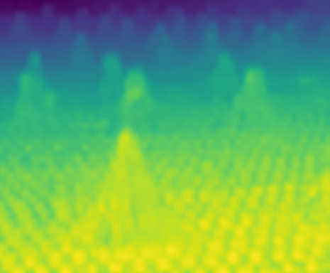 | 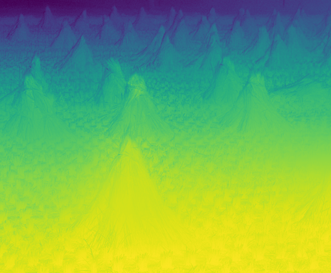 | 
|:---:|:---:|:---:|
| 1. Input Image `(I)` | 2. Output Transmission map `(t)` | 3. Transmission Map Refined `(T)` |

| 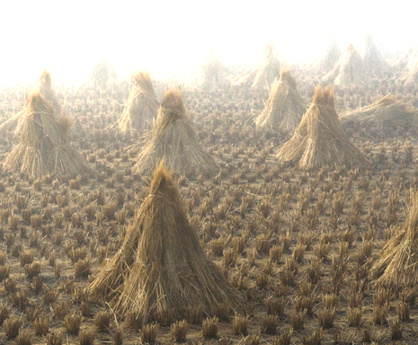 | 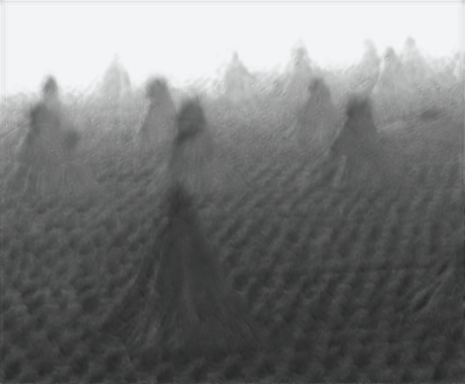 | 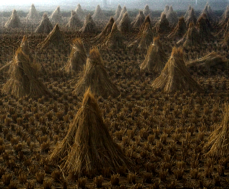 |
|:---:|:---:|:---:|
| 4. Residual Map Input `(H = I/T)` | 5. Residual Image `(b)` | 6. Generated Clear Image `(J)` |

## Results

**Outdoor**

| **Input** | **Output** |
|:---:|:---:|
|  | 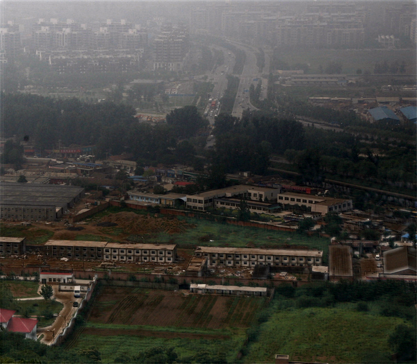 |
| 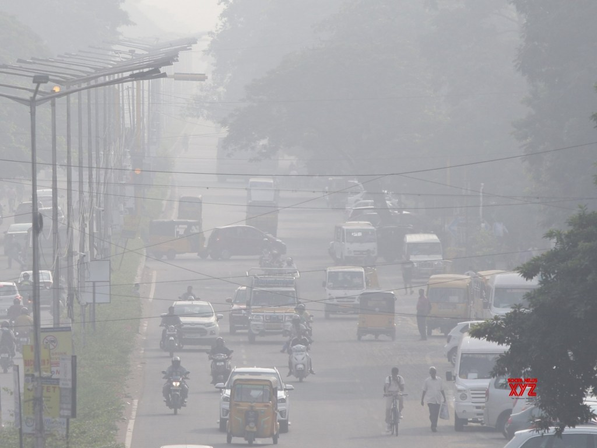 | 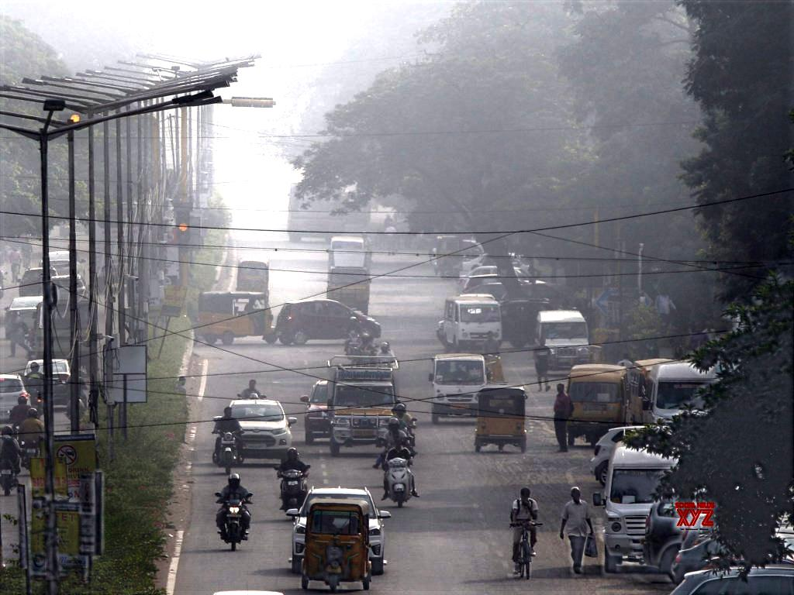 |

**Indoor**

| **Input** | **Output** |
|:---:|:---:|
| 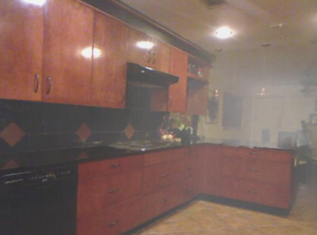 | 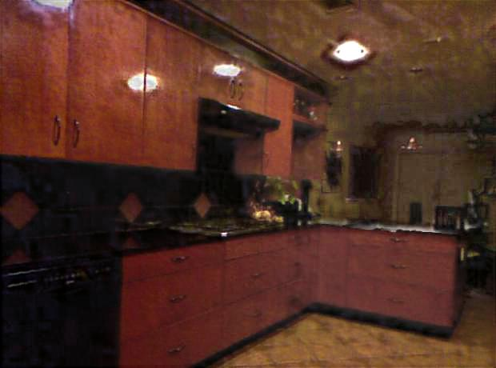 |
| 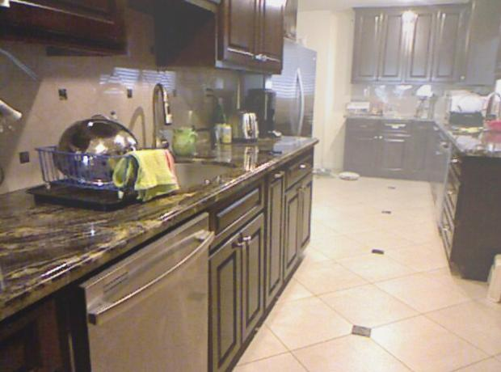 | 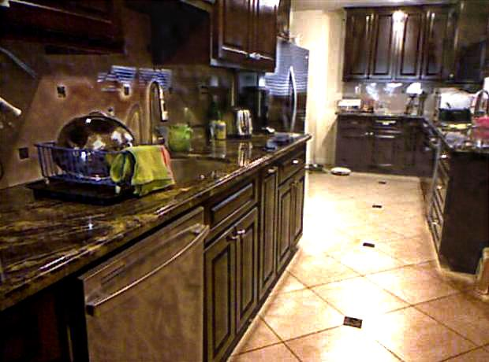 |

**For some images result were not as good**

|  |  |
|:---:|:---:|
| 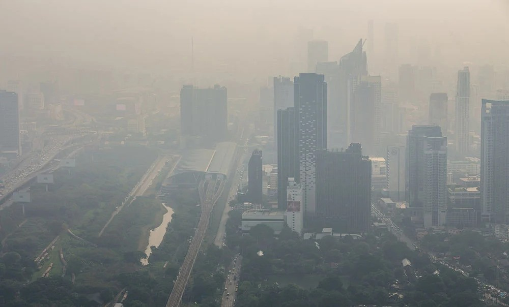 | 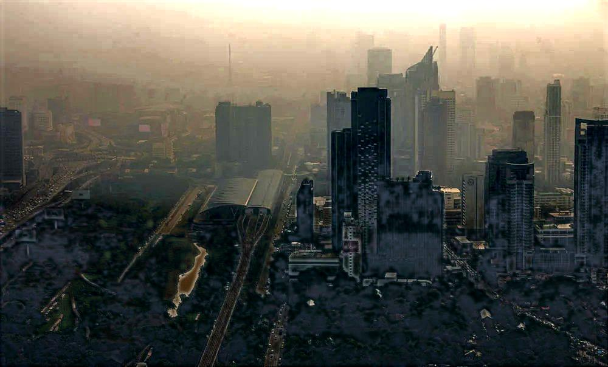 |
| 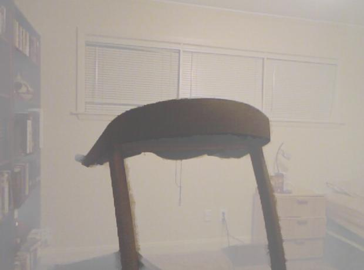 | 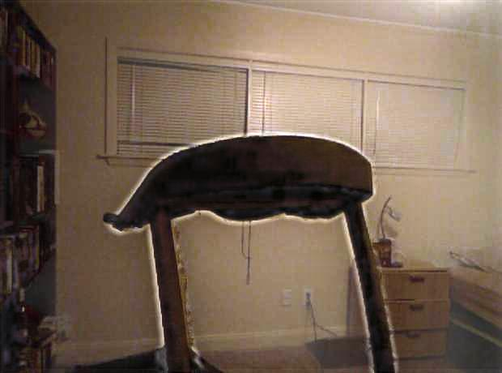 |
| 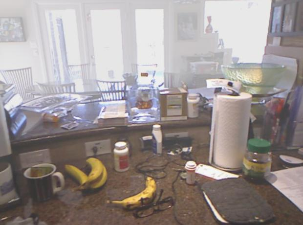 | 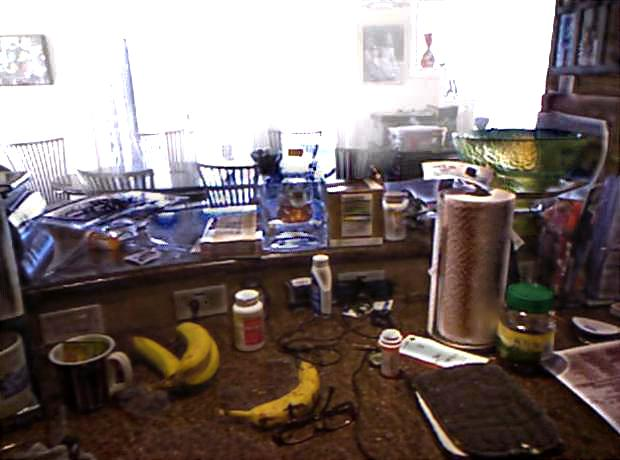 |

## Problems Faced

This is my first attempt to implement a Deep Learning research Paper. Many things is not clear in the paper itself, so tried on the assumptions, like : 
* The training dataset preparation is not specified properly, so used method mentioned in Dehazenet paper.
* Slice layer implementation is hard in Keras.
* Residual Network is not clear.

## References

**Datasets:**

* https://cs.nyu.edu/~silberman/datasets/nyu_depth_v2.html
* https://sites.google.com/view/reside-dehaze-datasets/reside-standard

**Papers :**
* DehazeNet: An End-to-End System for Single Image Haze Removal https://arxiv.org/abs/1601.07661
* AOD-Net: All-in-One Dehazing Network https://ieeexplore.ieee.org/document/8237773
* Recursive Deep Residual Learning for Single Image Dehazing https://ieeexplore.ieee.org/document/8575267/

**Reference Codes :**
* https://github.com/zlinker/DehazeNet
* https://github.com/yixindu1573/Recursive-Deep-Residual-Learning-for-Single-Image-Dehazing-DRL
* https://prateekvjoshi.com/2016/02/02/deep-learning-with-caffe-in-python-part-i-defining-a-layer/
* https://ddokkddokk.tistory.com/21
* https://stackoverflow.com/questions/42883547/intuitive-understanding-of-1d-2d-and-3d-convolutions-in-convolutional-neural-n
* https://github.com/keras-team/keras/issues/890
